# 🔗 Бинарные отношения 

---

## Navigation
- [[#1-basic-constructions|1. Basic Constructions]]
- [[#2-binary-relations|2. Binary Relations]]
- [[#3-relation-representation|3. Relation Representation]]
- [[#4-special-relations|4. Special Relations]]
- [[#5-inverse-relation|5. Inverse Relation]]
- [[#6-relation-operations|6. Relation Operations]]
- [[#7-relation-composition|7. Relation Composition]]
- [[#8-relation-properties|8. Relation Properties]]
- [[#9-relation-closures|9. Relation Closures]]
- [[#10-warshall-algorithm|10. Warshall Algorithm]]
- [[#11-equivalence-relations|11. Equivalence Relations]]
- [[#12-order-relations|12. Order Relations]]
- [[#13-posets|13. Partially Ordered Sets]]
- [[#14-lattices|14. Lattices]]
- [[#15-well-founded-relations|15. Well-founded Relations]]
- [[#16-functions|16. Functions]]
- [[#cheatsheet-binary-relations|Cheatsheet: Binary Relations]]

---

## 1-basic-constructions

### Упорядоченная пара
**Определение**: $(a, b)$ — структура, где порядок элементов существенен:
$$(a, b) = (c, d) \Leftrightarrow a = c \land b = d$$

**Свойство**: $(a, b) \neq (b, a)$ при $a \neq b$

### Кортеж
**Определение**: Упорядоченный набор элементов $(a_1, a_2, \ldots, a_n)$
- **Длина**: количество элементов $n$
- **Компоненты**: $a_i$ — $i$-я компонента кортежа

### Декартово произведение
**Определение**: 
$$A \times B = \{(a, b) \mid a \in A \land b \in B\}$$

**Свойства**:
- $|A \times B| = |A| \cdot |B|$ (для конечных множеств)
- $A \times \emptyset = \emptyset \times A = \emptyset$

**Пример**: 
$\{1,2\} \times \{x,y\} = \{(1,x), (1,y), (2,x), (2,y)\}$

[[#Navigation|🔼 Back to Navigation]]

## 2-binary-relations

### Определение
**Бинарное отношение** $R$ между множествами $A$ и $B$ — подмножество декартова произведения:
$$R \subseteq A \times B$$

### Классификация отношений
- **Однородное отношение**: $R \subseteq A \times A$ (отношение на одном множестве)
- **Неоднородное отношение**: $R \subseteq A \times B$, где $A \neq B$

**Пример однородного отношения**: 
Отношение "меньше" на $\mathbb{N}$: 
$R = \{(a,b) \in \mathbb{N} \times \mathbb{N} \mid a < b\}$

[[#Navigation|🔼 Back to Navigation]]

## 3-relation-representation

### Графическое представление
**Однородные отношения**: ориентированный граф
- **Вершины**: элементы множества $A$
- **Рёбра**: стрелки от $a$ к $b$ если $(a,b) \in R$

**Пример**: $A = \{1,2,3\}$, $R = \{(1,2), (2,3), (1,3)\}$

**Неоднородные отношения**: двудольный граф
- **Левые вершины**: элементы $A$
- **Правые вершины**: элементы $B$ 
- **Рёбра**: соединяют $a$ с $b$ если $(a,b) \in R$

**Пример**: $A = \{1,2\}$, $B = \{x,y\}$, $R = \{(1,x), (2,y)\}$

### Матричное представление
**Булева матрица отношения** $M_R$ размера $|A| \times |B|$:
$$M_R[i,j] = \begin{cases} 
1, & \text{если } (a_i, b_j) \in R \\
0, & \text{иначе}
\end{cases}$$

**Пример**: $A = \{1,2\}$, $B = \{x,y,z\}$, $R = \{(1,x), (2,y)\}$
$$M_R = \begin{bmatrix}
1 & 0 & 0 \\
0 & 1 & 0
\end{bmatrix}$$

[[#Navigation|🔼 Back to Navigation]]

## 4-special-relations

### Пустое отношение
$$\emptyset \subseteq A \times B$$
- Не содержит ни одной пары
- Матрица: нулевая матрица
- Граф: отсутствие рёбер

### Универсальное отношение
$$U = A \times B$$
- Содержит все возможные пары
- Матрица: матрица из единиц
- Граф: полный двудольный граф

### Тождественное отношение
$$\text{id}_A = \{(a,a) \mid a \in A\} \subseteq A \times A$$
- Каждый элемент связан только с самим собой
- Матрица: единичная матрица
- Граф: петли на всех вершинах

[[#Navigation|🔼 Back to Navigation]]

## 5-inverse-relation

### Определение
$$R^{-1} = \{(b,a) \mid (a,b) \in R\}$$

### Свойства
1. **Инволютивность**: $(R^{-1})^{-1} = R$
2. **Изменение областей**: если $R \subseteq A \times B$, то $R^{-1} \subseteq B \times A$
3. **Матричное представление**: $M_{R^{-1}} = M_R^T$ (транспонирование)

### Пример
$R = \{(1,x), (2,y)\} \subseteq A \times B$  
$R^{-1} = \{(x,1), (y,2)\} \subseteq B \times A$

**Матрицы**:
$$M_R = \begin{bmatrix}1 & 0 \\ 0 & 1\end{bmatrix}, \quad M_{R^{-1}} = \begin{bmatrix}1 & 0 \\ 0 & 1\end{bmatrix}^T = \begin{bmatrix}1 & 0 \\ 0 & 1\end{bmatrix}$$

[[#Navigation|🔼 Back to Navigation]]

## 6-relation-operations

### Бинарные операции
**Объединение**:
$$R \cup S = \{p \mid p \in R \lor p \in S\}$$

**Пересечение**:
$$R \cap S = \{p \mid p \in R \land p \in S\}$$

**Разность**:
$$R \setminus S = \{p \mid p \in R \land p \notin S\}$$

**Матричное представление** (поэлементные операции):
- $M_{R \cup S} = M_R \lor M_S$ (логическое ИЛИ)
- $M_{R \cap S} = M_R \land M_S$ (логическое И)
- $M_{R \setminus S} = M_R \land \neg M_S$

### Унарные операции
**Дополнение** (относительно универсума $A \times B$):
$$R^c = (A \times B) \setminus R = \{(a,b) \in A \times B \mid (a,b) \notin R\}$$

**Матричное представление**: $M_{R^c} = \neg M_R$ (логическое НЕ)

[[#Navigation|🔼 Back to Navigation]]

## 7-relation-composition

### Композиция отношений
**Определение**: Для $R \subseteq A \times B$ и $S \subseteq B \times C$
$$R ; S = \{(a,c) \in A \times C \mid \exists b \in B: (a,b) \in R \land (b,c) \in S\}$$

**Альтернативная нотация** (обратный порядок):
$$R \circ S = S ; R = \{(a,c) \in A \times C \mid \exists b \in B: (a,b) \in S \land (b,c) \in R\}$$

**Связь между нотациями**: $R ; S = S \circ R$

**Матричное представление**:
$$M_{R ; S} = M_R \cdot M_S \quad \text{(булево умножение)}$$

### Степени отношения
Для однородного отношения $R \subseteq A \times A$:

**Базовые случаи**:
- $R^0 = \text{id}_A = \{(a,a) \mid a \in A\}$
- $R^1 = R$

**Рекурсивное определение**:
$$R^{n+1} = R^n ; R = R ; R^n$$

**Свойства**:
- **Ассоциативность**: $R^m ; R^n = R^{m+n}$
- **Степень обратного**: $(R^{-1})^n = (R^n)^{-1}$

### Пример композиции
Пусть $A = \{1,2,3\}$, $R = \{(1,2), (2,3)\}$, $S = \{(2,1), (3,2)\}$

**Композиция R ; S**:
$R ; S = \{(1,1), (2,2)\}$  
Обоснование:
- $(1,1)$: $1 \xrightarrow{R} 2 \xrightarrow{S} 1$
- $(2,2)$: $2 \xrightarrow{R} 3 \xrightarrow{S} 2$

**Композиция R ∘ S**:
$R \circ S = S ; R = \{(2,2), (3,3)\}$  
Обоснование:
- $(2,2)$: $2 \xrightarrow{S} 1 \xrightarrow{R} 2$
- $(3,3)$: $3 \xrightarrow{S} 2 \xrightarrow{R} 3$

**Матричное представление**:
$$M_R = \begin{bmatrix}0 & 1 & 0\\0 & 0 & 1\\0 & 0 & 0\end{bmatrix}, \quad 
M_S = \begin{bmatrix}0 & 0 & 0\\1 & 0 & 0\\0 & 1 & 0\end{bmatrix}$$

$$M_{R ; S} = M_R \cdot M_S = \begin{bmatrix}1 & 0 & 0\\0 & 1 & 0\\0 & 0 & 0\end{bmatrix}, \quad
M_{R \circ S} = M_S \cdot M_R = \begin{bmatrix}0 & 0 & 0\\0 & 1 & 0\\0 & 0 & 1\end{bmatrix}$$

### Важное замечание
В различных учебниках используются разные обозначения:
- **Нотация ";"**: $R ; S$ — сначала применяется $R$, затем $S$
- **Нотация "∘"**: $R \circ S$ — сначала применяется $S$, затем $R$

[[#Navigation|🔼 Back to Navigation]]

## 8-relation-properties

### Reflexive (Рефлексивность)
**Определение**: $\forall x \in M: x R x$  
**Матрица**: Все элементы на главной диагонали равны 1  
**Граф**: Петли на всех вершинах  
**Пример**: Отношение "≤" на ℝ

### Irreflexive (Иррефлексивность)
**Определение**: $\forall x \in M: \neg(x R x)$  
**Матрица**: Все элементы на главной диагонали равны 0  
**Граф**: Отсутствие петель  
**Пример**: Отношение "<" на ℝ

### Coreflexive (Корефлексивность)
**Определение**: $\forall x, y \in M: (x R y) \rightarrow (x = y)$  
**Свойство**: $R \subseteq id_M$  
**Пример**: Отношение равенства

### Symmetric (Симметричность)
**Определение**: $\forall x, y \in M: (x R y) \rightarrow (y R x)$  
**Матрица**: Симметричная матрица ($M = M^T$)  
**Граф**: Все рёбра двусторонние  
**Пример**: Отношение "быть родственником"

### Antisymmetric (Антисимметричность)
**Определение**: $\forall x, y \in M: (x R y) \land (y R x) \rightarrow (x = y)$  
**Матрица**: Если $m_{ij} = 1$ и $i \neq j$, то $m_{ji} = 0$  
**Пример**: Отношение "≤" на ℝ

### Asymmetric (Асимметричность)
**Определение**: $\forall x, y \in M: (x R y) \rightarrow \neg(y R x)$  
**Следствие**: Одновременно Irreflexive и Antisymmetric  
**Пример**: Отношение "<" на ℝ

### Transitive (Транзитивность)
**Определение**: $\forall x, y, z \in M: (x R y) \land (y R z) \rightarrow (x R z)$  
**Матрица**: $M^2 \leq M$ (в булевой алгебре)  
**Пример**: Отношение "делит" на ℕ

### Right Euclidean (Правая евклидовость)
**Определение**: $\forall x, y, z \in M: (x R y) \land (x R z) \rightarrow (y R z)$  
**Интерпретация**: Все элементы, связанные с общим элементом, связаны между собой

### Left Euclidean (Левая евклидовость)
**Определение**: $\forall x, y, z \in M: (y R x) \land (z R x) \rightarrow (y R z)$  
**Интерпретация**: Все элементы, связанные с общим элементом в обратную сторону, связаны между собой

### Semiconnex (Связность)
**Определение**: $\forall x, y \in M: (x \neq y) \rightarrow (x R y) \lor (y R x)$  
**Пример**: Отношение "≤" на ℝ (для любых двух различных чисел одно меньше другого)

### Connex (Сильная связность)
**Определение**: $\forall x, y \in M: (x R y) \lor (y R x)$  
**Включает**: Все пары, включая диагональные  
**Пример**: Отношение "≤" на ℝ с учётом равенства

### Dense (Плотность)
**Определение**: $\forall x, y \in M: (x R y) \rightarrow \exists z \in M: (x R z) \land (z R y)$  
**Пример**: Отношение "<" на ℚ (между любыми двумя рациональными числами есть третье)

[[#Navigation|🔼 Back to Navigation]]

## 9-relation-closures

### Рефлексивное замыкание
**Обозначение**: $r(R)$ или $R^=$  
**Определение**: $r(R) = R \cup id_A$  
**Свойство**: Наименьшее рефлексивное отношение, содержащее $R$

### Симметричное замыкание
**Обозначение**: $s(R)$ или $R^↔$  
**Определение**: $s(R) = R \cup R^{-1}$  
**Свойство**: Наименьшее симметричное отношение, содержащее $R$

### Транзитивное замыкание
**Обозначение**: $t(R)$ или $R^+$  
**Определение**: $t(R) = \bigcup_{k \geq 1} R^k = R \cup R^2 \cup R^3 \cup \cdots$  
**Свойство**: Наименьшее транзитивное отношение, содержащее $R$

[[#Navigation|🔼 Back to Navigation]]

## 10-warshall-algorithm

**Назначение**: Вычисление транзитивного замыкания $R^+$  
**Вход**: Матрица смежности $M$ отношения $R$ на $n$ элементах  
**Выход**: Матрица смежности $T$ транзитивного замыкания $R^+$

**Псевдокод**:
```bash
T := M
  for k from 1 to n:
    for i from 1 to n:
      for j from 1 to n:
        T[i,j] := T[i,j] ∨ (T[i,k] ∧ T[k,j])
```

**Асимптотическая сложность**: $O(n^3)$  
**Память**: $O(n^2)$

**Пример работы**:
Для отношения $R = \{(1,2), (2,3)\}$ на множестве $\{1,2,3\}$:

Исходная матрица: $\begin{bmatrix}0&1&0\\0&0&1\\0&0&0\end{bmatrix}$

После алгоритма :   $\begin{bmatrix}0&1&1\\0&0&1\\0&0&0\end{bmatrix}$ (добавилось $(1,3)$)

[[#Navigation|🔼 Back to Navigation]]

## 11-equivalence-relations

### Определение
Отношение $R$ на множестве $A$ называется **отношением эквивалентности**, если оно обладает свойствами:
- **Reflexive**: $\forall a \in A: a R a$
- **Symmetric**: $\forall a,b \in A: a R b \rightarrow b R a$  
- **Transitive**: $\forall a,b,c \in A: a R b \land b R c \rightarrow a R c$

### Класс эквивалентности
**Определение**: Для $a \in A$ класс эквивалентности:
$$[a] = \{x \in A \mid x R a\}$$

**Свойства классов**:
1. $a \in [a]$ (рефлексивность)
2. $[a] = [b] \Leftrightarrow a R b$ 
3. $[a] \cap [b] \neq \emptyset \Rightarrow [a] = [b]$ (непересекаемость)
4. $\bigcup_{a \in A} [a] = A$ (покрытие множества)

### Фактор-множество
**Определение**: Множество всех классов эквивалентности:
$$A/R = \{[a] \mid a \in A\}$$

**Мощность**: $|A/R|$ называется **индексом** отношения эквивалентности

### Примеры отношений эквивалентности

#### 1. Сравнимость по модулю n
**Определение**: $a \equiv b \pmod{n} \Leftrightarrow n \mid (a - b)$  
**Классы**: $[a] = \{a + kn \mid k \in \mathbb{Z}\}$  
**Фактор-множество**: $\mathbb{Z}_n = \{[0], [1], \dots, [n-1]\}$  
**Пример**: При $n=3$: $[0] = \{\dots, -3, 0, 3, 6, \dots\}$, $[1] = \{\dots, -2, 1, 4, 7, \dots\}$

#### 2. Отношение "быть одного возраста"
**Определение**: Люди эквивалентны, если родились в одном году  
**Классы**: Все люди, родившиеся в 1990, 1991, ... годах  
**Фактор-множество**: Множество годов рождения

#### 3. Равенство фигур по площади
**Определение**: Две фигуры эквивалентны, если имеют одинаковую площадь  
**Классы**: Все фигуры площадью $S$ образуют класс $[S]$  
**Фактор-множество**: $\mathbb{R}^+$ (множество положительных чисел)

### Теорема о разбиении
**Формулировка**: Всякое отношение эквивалентности задаёт разбиение множества на классы, и наоборот — всякое разбиение множества определяет отношение эквивалентности.

**Доказательство**:
- ($\Rightarrow$) Классы эквивалентности образуют разбиение
- ($\Leftarrow$) Если $A = \bigcup A_i$ — разбиение, то отношение "$a$ и $b$ лежат в одном блоке" есть отношение эквивалентности

[[#Navigation|🔼 Back to Navigation]]

## 12-order-relations

#### 1. Предпорядок, Квазипорядок (Preorder)
**Определение**: Рефлексивное и транзитивное отношение  
**Свойства**:
- **Reflexive**: $\forall a \in A: a R a$
- **Transitive**: $\forall a,b,c \in A: (a R b \land b R c) \rightarrow a R c$

**Особенность**: Могут существовать разные элементы, которые "эквивалентны" в смысле порядка ($a R b$ и $b R a$, но $a \neq b$)

**Пример**: Отношение "делит" на целых числах:  
2 делит -2 и -2 делит 2, но 2 ≠ -2

#### 2. Частичный порядок (Partial Order)
**Определение**: Рефлексивное, антисимметричное и транзитивное отношение  
**Свойства**:
- **Reflexive**: $\forall a \in A: a R a$
- **Antisymmetric**: $\forall a,b \in A: (a R b \land b R a) \rightarrow a = b$
- **Transitive**: $\forall a,b,c \in A: (a R b \land b R c) \rightarrow a R c$

**Обозначение**: $\leq$ или $\preceq$

**Примеры**:
- Отношение "$\subseteq$" на множестве подмножеств
- Отношение "делит" на натуральных числах
- Отношение "$\leq$" на вещественных числах

#### 3. Линейный/Полный порядок (Linear Order / Total Order) 
**Определение**: Частичный порядок, в котором все элементы сравнимы  
**Дополнительное свойство**:
- **Connex** (Strongly connected): $\forall a,b \in A: (a \leq b) \lor (b \leq a)$

**Примеры**:
- Отношение "$\leq$" на $\mathbb{R}$
- Лексикографический порядок на словах
- Хронологический порядок событий

#### 4. Строгий частичный порядок (Strict Partial Order) 
**Определение**: Иррефлексивное и транзитивное отношение  
**Свойства**:
- **Irreflexive**: $\forall a \in A: \neg(a R a)$
- **Transitive**: $\forall a,b,c \in A: (a R b \land b R c) \rightarrow a R c$

**Следствие**: Автоматически антисимметрично

**Обозначение**: $<$ или $\prec$

**Примеры**:
- Отношение "$<$" на $\mathbb{R}$
- Отношение "$\subset$" (строгое включение) на множествах

#### 5. Строгий линейный порядок (Strict Total Order)
**Определение**: Строгий частичный порядок, в котором все различные элементы сравнимы  
**Дополнительное свойство**:
- **Semiconnex**: $\forall a \neq b \in A: (a < b) \lor (b < a)$

**Примеры**:
- Отношение "$<$" на $\mathbb{R}$
- Алфавитный порядок на различных словах

### Сводная таблица свойств

| Тип порядка | Рефлексивность | Иррефлексивность | Антисимметричность | Транзитивность | Связность |
|-------------|----------------|------------------|-------------------|----------------|-----------|
| Preorder | ✅ | ❌ | ❌ | ✅ | ❌ |
| Partial Order | ✅ | ❌ | ✅ | ✅ | ❌ |
| Linear Order | ✅ | ❌ | ✅ | ✅ | ✅ |
| Strict Partial Order | ❌ | ✅ | ✅ | ✅ | ❌ |
| Strict Total Order | ❌ | ✅ | ✅ | ✅ | ✅ |

[[#Navigation|🔼 Back to Navigation]]

## 13-posets

### Определение Poset

**Poset** (Partially Ordered Set) — это упорядоченная пара $(A, \leq)$, где:
- $A$ — произвольное множество
- $\leq$ — отношение частичного порядка на $A$ (рефлексивное, антисимметричное, транзитивное)

**Пример**: $(P(\{1,2,3\}), \subseteq)$ — множество подмножеств с отношением включения

### Диаграмма Хассе (Hasse Diagram)

**Определение**: Специальное графическое представление poset, где:
- Элементы изображаются точками
- Если $a < b$ и НЕТ $c$ такого, что $a < c < b$, то проводится линия от $a$ к $b$
- Более крупные элементы рисуются ВЫШЕ меньших
- **Убираются все транзитивные рёбра и петли**

**Пример 1**: Poset $(\{1,2,3,4,6,12\}, \mid)$ (отношение делимости)
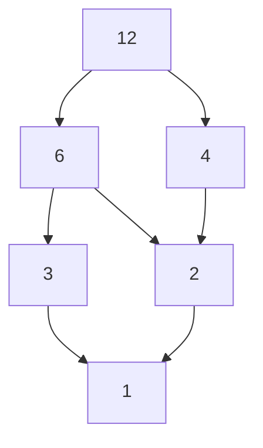

**Пример 2**: Poset $(P(\{a,b\}), \subseteq)$
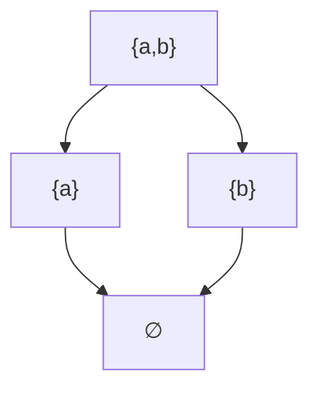

### Отношение покрытия (Covering Relation)

**Определение**: $b$ **покрывает** $a$ (обозначается $a \lessdot b$), если:
1. $a < b$
2. Не существует $c$ такого, что $a < c < b$

**На диаграмме Хассе**: Проводится линия только между элементами, связанными отношением покрытия

**Пример**: В poset $(\{1,2,3,6\}, \mid)$:
- 2 покрывает 1 (2 ⋖ 1)
- 6 покрывает 2 и 3 (6 ⋖ 2, 6 ⋖ 3)
- 6 НЕ покрывает 1 (т.к. есть 2: 1 < 2 < 6)

### Сравнимые и несравнимые элементы

**Сравнимые элементы**: $a$ и $b$ сравнимы, если $a \leq b$ или $b \leq a$

**Несравнимые элементы**: $a$ и $b$ несравнимы, если $a \nleq b$ и $b \nleq a$

**Пример**: В poset делителей 12:
- 2 и 3 — несравнимы (2 не делит 3, 3 не делит 2)
- 2 и 6 — сравнимы (2 ≤ 6)

### Цепи и антицепи

#### Цепь (Chain)
**Определение**: Подмножество, в котором ЛЮБЫЕ ДВА элемента сравнимы

**Длина цепи**: Количество элементов в цепи минус 1

**Пример**: В $(\{1,2,3,4,6,12\}, \mid)$:
- $\{1,2,6,12\}$ — цепь длины 3
- $\{1,3\}$ — цепь длины 1

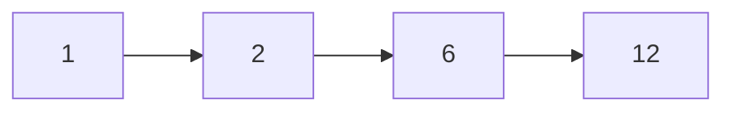

#### Антицепь (Antichain)
**Определение**: Подмножество, в котором ЛЮБЫЕ ДВА РАЗЛИЧНЫХ элемента НЕСРАВНИМЫ

**Пример**: В $(\{1,2,3,4,6,12\}, \mid)$:
- $\{4,6\}$ — антицепь (4 не делит 6, 6 не делит 4)


### Минимальные и максимальные элементы

#### Минимальный элемент
**Определение**: Элемент $m$ минимален, если НЕ СУЩЕСТВУЕТ $x$ такого, что $x < m$

**На диаграмме Хассе**: Элементы, из которых НЕ ВХОДЯТ стрелки сверху

**Пример**: В $(\{1,2,3,6\}, \mid)$: 1 — минимальный элемент

#### Максимальный элемент
**Определение**: Элемент $M$ максимален, если НЕ СУЩЕСТВУЕТ $x$ такого, что $M < x$

**На диаграмме Хассе**: Элементы, из которых НЕ ВЫХОДЯТ стрелки вверх

**Пример**: В $(\{1,2,3,6\}, \mid)$: 6 — максимальный элемент

**Важно**: Может быть несколько минимальных/максимальных элементов!

### Наименьший и наибольший элементы

#### Наименьший элемент (Minimum, Bottom)
**Определение**: Элемент $0$ наименьший, если $\forall x \in A: 0 \leq x$

**Свойство**: Если существует, то ТОЛЬКО ОДИН

**Пример**: В $(P(A), \subseteq)$: $\emptyset$ — наименьший элемент

#### Наибольший элемент (Maximum, Top)
**Определение**: Элемент $1$ наибольший, если $\forall x \in A: x \leq 1$

**Свойство**: Если существует, то ТОЛЬКО ОДИН

**Пример**: В $(P(A), \subseteq)$: $A$ — наибольший элемент

**Различие**: 
- Минимальный: нет элементов МЕНЬШЕ него
- Наименьший: МЕНЬШЕ или равен ВСЕМ элементам

### Верхние и нижние грани

#### Верхняя грань (Upper Bound)
**Определение**: Для $S \subseteq A$, элемент $u$ — верхняя грань, если $\forall s \in S: s \leq u$

**Пример**: Для $S = \{2,3\}$ в $(\{1,2,3,6,12\}, \mid)$:
- Верхние грани: 6, 12

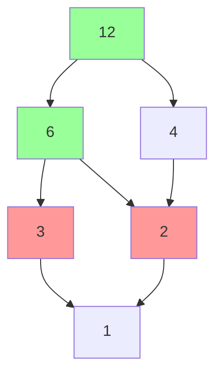

#### Нижняя грань (Lower Bound)
**Определение**: Для $S \subseteq A$, элемент $l$ — нижняя грань, если $\forall s \in S: l \leq s$

**Пример**: Для $S = \{4,6\}$ в $(\{1,2,3,4,6,12\}, \mid)$:
- Нижние грани: 1, 2

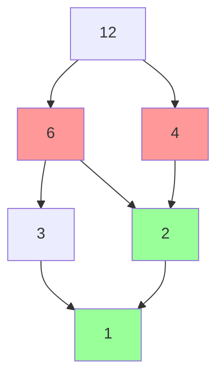

### Инфимум и супремум

#### Супремум (Supremum, Join)
**Определение**: Наименьшая верхняя грань множества $S$
- Обозначение: $\sup S$ или $\bigvee S$

**Пример**: Для $S = \{2,3\}$ в $(\{1,2,3,6,12\}, \mid)$:
- Верхние грани: 6, 12
- Супремум: 6 (наименьшая из верхних граней)

#### Инфимум (Infimum, Meet)
**Определение**: Наибольшая нижняя грань множества $S$
- Обозначение: $\inf S$ или $\bigwedge S$

**Пример**: Для $S = \{4,6\}$ в $(\{1,2,3,4,6,12\}, \mid)$:
- Нижние грани: 1, 2
- Инфимум: 2 (наибольшая из нижних граней)

### Теорема Дилворта (Dilworth's Theorem)

**Формулировка**: В любом конечном poset:
```
Размер наибольшей антицепи = Минимальное количество цепей, покрывающих всё множество
```

**Пример**: 
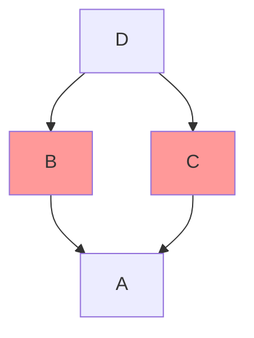

- Наибольшая антицепь: $\{B,C\}$ (размер 2)
- Минимальное покрытие цепями: $\{A,B,D\}$ и $\{A,C\}$ (2 цепи)

**Применение**: В теории расписаний, комбинаторике, оптимизации

### Практические примеры

#### Пример 1: Делители числа 30
$(\{1,2,3,5,6,10,15,30\}, \mid)$
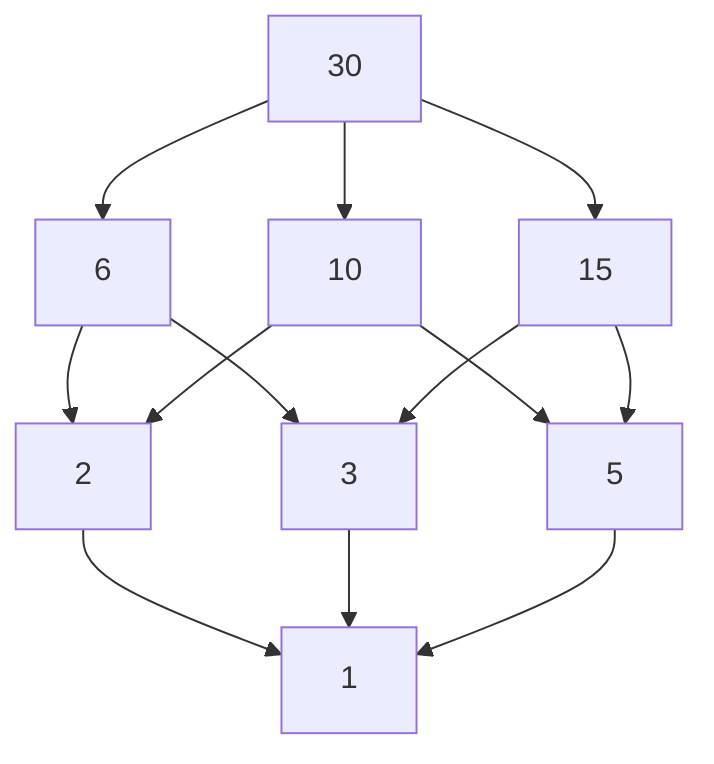

- Минимальный: 1
- Максимальный: 30
- Антицепи: {2,3,5}, {6,10,15}

#### Пример 2: Подмножества {x,y,z}
$(P(\{x,y,z\}), \subseteq)$
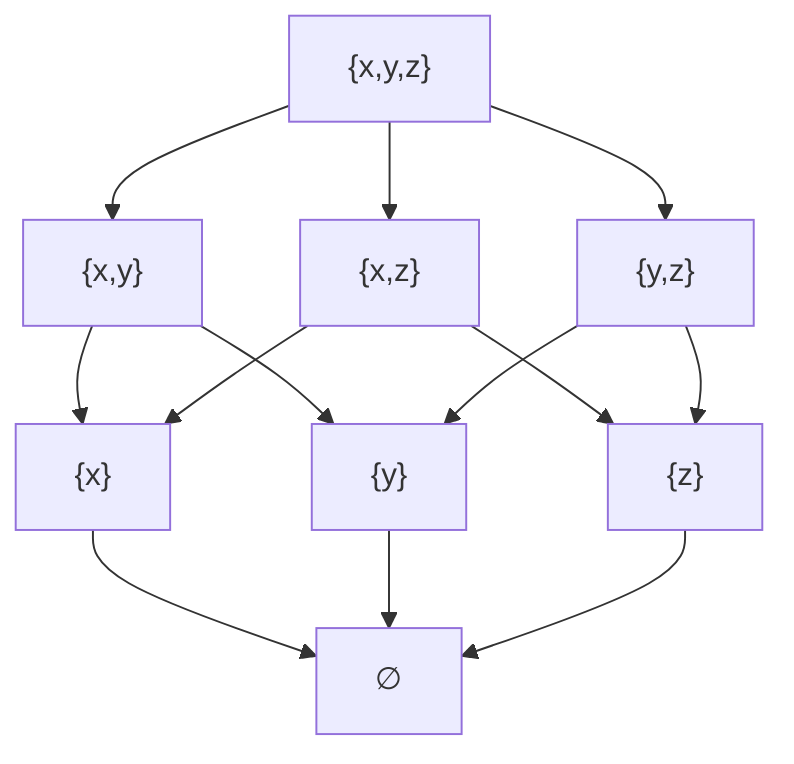

- Наименьший: ∅
- Наибольший: {x,y,z}
- Цепь: ∅ ⊆ {x} ⊆ {x,y} ⊆ {x,y,z}

[[#Navigation|🔼 Back to Navigation]]

## 14-lattices

### Определение решётки

**Решётка** — это частично упорядоченное множество (poset), в котором для любых двух элементов $a$ и $b$ существуют:
- **Супремум** (наименьшая верхняя грань) $a \vee b$
- **Инфимум** (наибольшая нижняя грань) $a \wedge b$

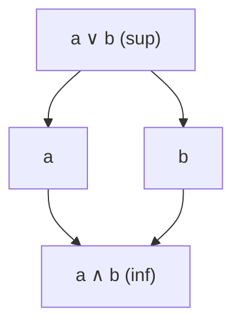

### Операции join и meet

#### Join (объединение)
**Обозначение**: $a \vee b$  
**Определение**: Наименьшая верхняя грань элементов $a$ и $b$  
**Свойства**:
- $a \leq a \vee b$, $b \leq a \vee b$
- Если $a \leq c$ и $b \leq c$, то $a \vee b \leq c$

#### Meet (пересечение)
**Обозначение**: $a \wedge b$  
**Определение**: Наибольшая нижняя грань элементов $a$ и $b$  
**Свойства**:
- $a \wedge b \leq a$, $a \wedge b \leq b$
- Если $c \leq a$ и $c \leq b$, то $c \leq a \wedge b$

### Примеры решёток

#### Пример 1: Булеан (множество подмножеств)
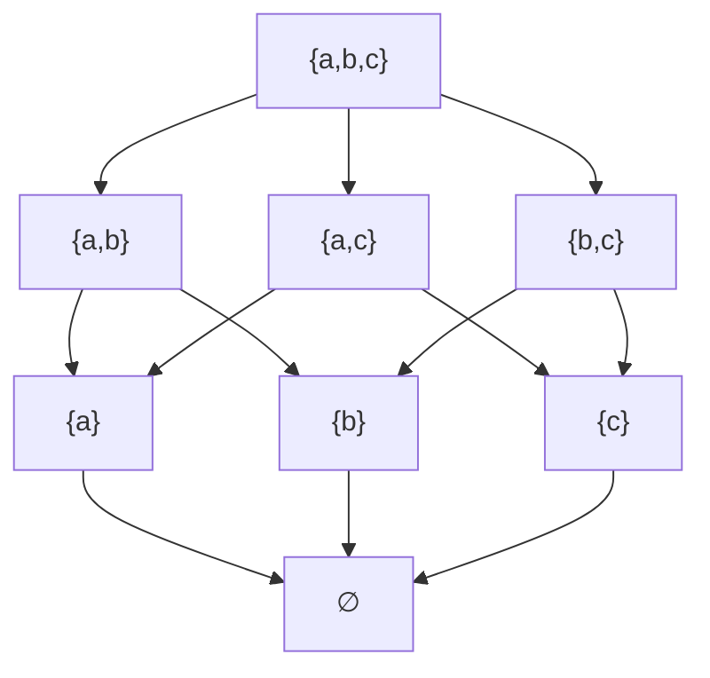

**Операции**:
- $A \vee B = A \cup B$ (объединение)
- $A \wedge B = A \cap B$ (пересечение)

#### Пример 2: Делители числа 30


**Операции**:
- $a \vee b = \text{НОК}(a,b)$ (наименьшее общее кратное)
- $a \wedge b = \text{НОД}(a,b)$ (наибольший общий делитель)

### Типы решёток

#### 1. Ограниченная решётка (Bounded Lattice)
**Определение**: Решётка, в которой существуют:
- **Наибольший элемент** ($\top$, "top", единица)
- **Наименьший элемент** ($\bot$, "bottom", ноль)

**Пример**: $(P(X), \subseteq)$
- $\top = X$ (всё множество)
- $\bot = \emptyset$ (пустое множество)

#### 2. Дистрибутивная решётка (Distributive Lattice)
**Определение**: Решётка, удовлетворяющая законам дистрибутивности:
1. $a \wedge (b \vee c) = (a \wedge b) \vee (a \wedge c)$
2. $a \vee (b \wedge c) = (a \vee b) \wedge (a \vee c)$

**Примеры**:
- Булеан множества
- Линейно упорядоченные множества

**Контрпример**: НЕдистрибутивная решётка "ромб":
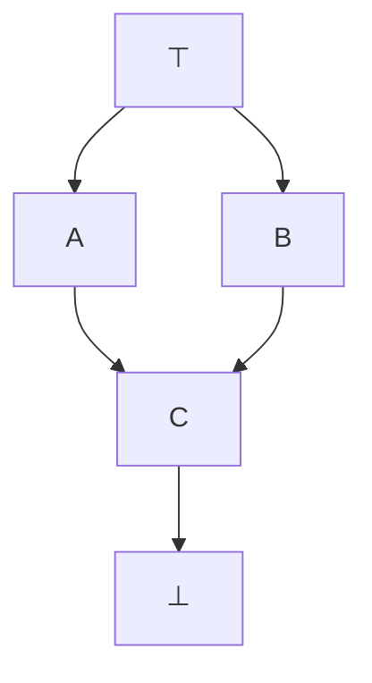

#### 3. Модулярная решётка (Modular Lattice)
**Определение**: Решётка, удовлетворяющая модулярному закону:
Если $a \leq c$, то $a \vee (b \wedge c) = (a \vee b) \wedge c$

**Свойство**: Все дистрибутивные решётки модулярны, но не наоборот

#### 4. Дополняемая решётка (Complemented Lattice)
**Определение**: Ограниченная решётка, в которой для каждого $a$ существует дополнение $a'$ такое, что:
- $a \vee a' = \top$
- $a \wedge a' = \bot$

**Пример**: В булеане: дополнение $A' = X \setminus A$

#### 5. Булева алгебра (Boolean Algebra)
**Определение**: Дистрибутивная дополняемая решётка

**Свойства**:
- Дистрибутивность
- Существование дополнений
- Законы Де Моргана: $(a \vee b)' = a' \wedge b'$, $(a \wedge b)' = a' \vee b'$

### Сравнение типов решёток

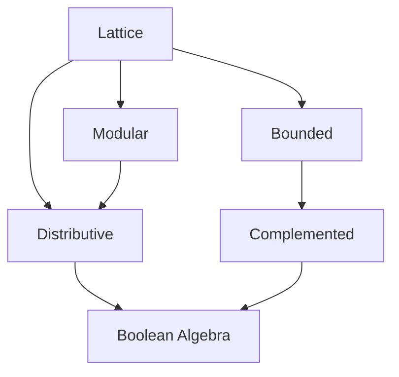

### Упражнения для понимания

1. **Проверка**: Является ли множество делителей 24 решёткой?
2. **Операции**: Найдите $4 \vee 6$ и $4 \wedge 6$ в решётке делителей
3. **Дополнения**: В булеане $\{1,2,3\}$ найдите дополнение $\{1,3\}$
4. **Дистрибутивность**: Проверьте, дистрибутивна ли решётка "ромб"

**Ответы**:
1. Да, с операциями НОД и НОК
2. $4 \vee 6 = 12$ (НОК), $4 \wedge 6 = 2$ (НОД)
3. $\{1,3\}' = \{2\}$
4. Нет, не дистрибутивна

[[#Navigation|🔼 Back to Navigation]]

## 15-well-founded-relations

### Фундированные отношения (Well-founded Relations)

**Определение**: Отношение $R$ на множестве $A$ называется **фундированным**, если каждое непустое подмножество $B \subseteq A$ имеет минимальный элемент относительно $R$.

**Формально**: 
$$\forall B \subseteq A, B \neq \emptyset : \exists m \in B : \neg\exists x \in B : (x, m) \in R$$

**Эквивалентное определение**: Не существует бесконечных строго убывающих цепочек:
$$a_1 > a_2 > a_3 > \cdots$$

#### Примеры фундированных отношений

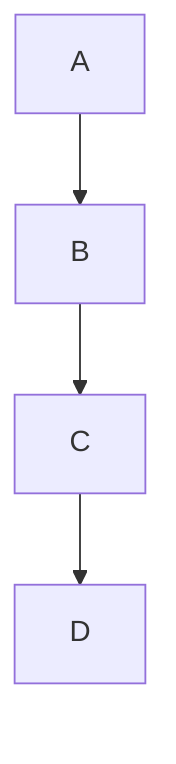

**✅ Фундированные**:
- $(N, <)$ — натуральные числа с обычным порядком
- Конечные цепочки
- Деревья с корнем внизу

**❌ НЕ фундированные**:
- $(Z, <)$ — целые числа
- $(R, <)$ — вещественные числа
- Циклические графы

### Вполне упорядоченные множества (Well-ordered Sets)

**Опредечение**: Линейно упорядоченное множество $(A, \leq)$ называется **вполне упорядоченным**, если каждое непустое подмножество $B \subseteq A$ имеет наименьший элемент.


**Свойства**:
- Все вполне упорядоченные множества фундированы
- Все конечные линейно упорядоченные множества вполне упорядочены
- $(N, \leq)$ — классический пример
- $(Z, \leq)$ — НЕ вполне упорядочено (нет наименьшего элемента)

#### Пример: Натуральные числа
```
1 < 2 < 3 < 4 < ...
```
Любое подмножество имеет наименьший элемент.

### Принцип вполне упорядоченности и индукция

#### Принцип полной индукции для фундированных отношений
Если $(A, <)$ — фундированное множество, то:
$$\forall x \in A [(\forall y < x : P(y)) \Rightarrow P(x)] \Rightarrow \forall x \in A : P(x)$$

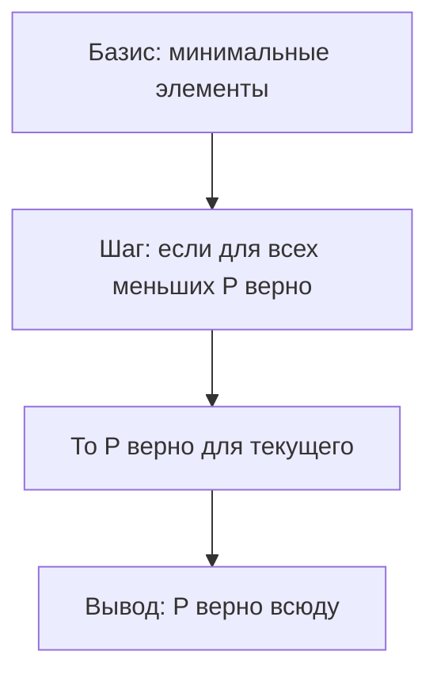

#### Пример: Индукция по натуральным числам
**База**: $P(1)$ верно  
**Шаг**: Если $P(k)$ верно для всех $k < n$, то $P(n)$ верно  
**Вывод**: $P(n)$ верно для всех $n \in N$

### Условия обрыва цепей

#### DCC (Descending Chain Condition)
**Определение**: Нет бесконечных строго убывающих цепочек:
$$a_1 > a_2 > a_3 > \cdots$$

**Эквивалентность**: DCC ⇔ Фундированность

#### ACC (Ascending Chain Condition)
**Определение**: Нет бесконечных строго возрастающих цепочек:
$$a_1 < a_2 < a_3 < \cdots$$

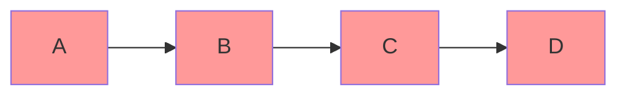

### Нётеровы отношения (Noetherian Relations)

**Определение**: Отношение $R$ называется **нётеровым**, если $R^{-1}$ фундировано.

**Эквивалентно**: ACC для $R$

**Свойства**:
- Все конечные отношения нётеровы
- $(N, \leq)$ нётерово
- $(N, \geq)$ НЕ нётерово

### Анализ завершимости (Termination Analysis)

**Применение**: Доказательство завершения программ и вычислений

**Метод**: Найти фундированное множество $(A, <)$ и функцию $f : \text{Состояния} \to A$ такую, что:
- Если состояние $s_1$ переходит в $s_2$, то $f(s_1) > f(s_2)$
- Тогда вычисление обязательно завершится

#### Пример: Факториал
```python
def factorial(n):
    if n == 0: return 1
    return n * factorial(n-1)
```

**Мера**: $f(n) = n$  
**Порядок**: $(N, <)$ — фундирован  
**Убывание**: $f(n) = n > n-1 = f(n-1)$

### Иерархия свойств

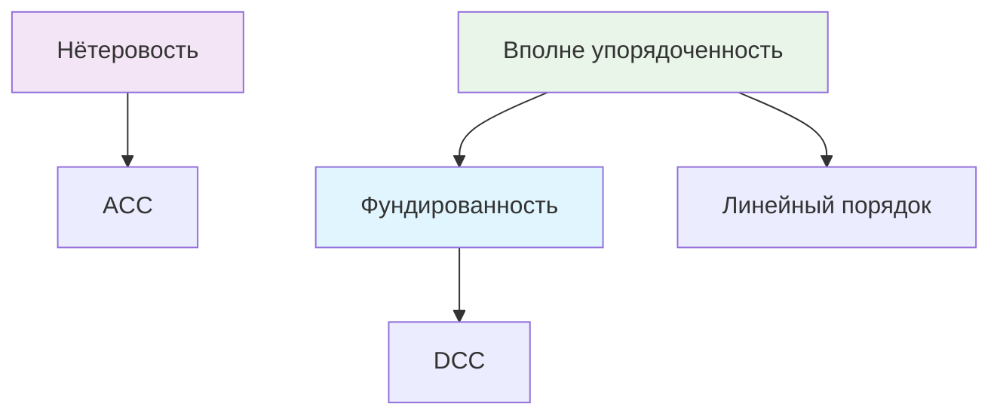

### Практические примеры

#### Пример 1: Дерево вызовов
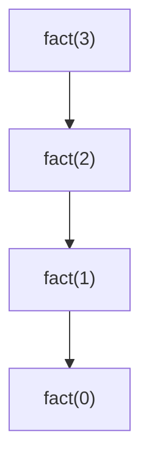

**Фундированность**: Глубина вызовов убывает

#### Пример 2: Сортировка списка
```mermaid
graph LR
    A["[3,1,2]"] --> B["[1,3,2]"]
    B --> C["[1,2,3]"]
```

**Мера**: Количество инверсий убывает

### Теоремы и важные факты

#### Теорема Цермело
Любое множество можно вполне упорядочить (эквивалентно аксиоме выбора)

### Упражнения для понимания

1. **Проверка**: Является ли $(Z, <)$ фундированным?
2. **Построение**: Приведите пример нётерова, но не вполне упорядоченного множества
3. **Индукция**: Сформулируйте принцип индукции для $(P(N), \subset)$
4. **Завершимость**: Докажите завершимость алгоритма Евклида

**Ответы**:
1. ❌ Нет (..., -2, -1, 0, 1, 2, ...)
2. $(N, \leq)$ — нётерово, но не вполне упорядочено (в смысле строгого порядка)
3. Если для множества $A$ верно, что для всех собственных подмножеств $B \subset A$ выполняется $P(B)$, то $P(A)$
4. Мера: сумма аргументов убывает в $(N, <)$

[[#Navigation|🔼 Back to Navigation]]

## 16-functions

### Определение функции

**Функция** $f: A \to B$ — это бинарное отношение $f \subseteq A \times B$, удовлетворяющее:

1. **Функциональность** (однозначность):
   $$\forall a \in A \, \forall b_1,b_2 \in B: (a,b_1) \in f \land (a,b_2) \in f \Rightarrow b_1 = b_2$$
   *Каждому аргументу соответствует не более одного значения*

2. **Всюду-определённость** (тотальность):
   $$\forall a \in A \, \exists b \in B: (a,b) \in f$$
   *Каждому аргументу соответствует хотя бы одно значение*

```mermaid
flowchart TD
    subgraph A [Множество A]
        a1[Элемент a]
    end
    
    subgraph B [Множество B]
        b1[Элемент b]
    end
    
    a1 -->|f| b1
```

### Частичная функция

**Частичная функция** $f: A \rightharpoonup B$ — отношение, удовлетворяющее функциональности, но не обязательно всюду-определённости.

**Пример**: $f: \mathbb{R} \rightharpoonup \mathbb{R}$, $f(x) = \frac{1}{x}$ не определена при $x = 0$

### Основные понятия

#### Область определения (Domain)
$$\text{dom}(f) = \{a \in A \mid \exists b \in B: (a,b) \in f\}$$

#### Область значений (Image/Range)
$$\text{im}(f) = \{f(a) \mid a \in A\}$$

### Классификация функций

#### Инъекция (Injection, "вложение")
$$\forall a_1,a_2 \in A: f(a_1) = f(a_2) \Rightarrow a_1 = a_2$$
*Разные аргументы → разные значения*

```mermaid
flowchart LR
    subgraph A [Множество A]
        a1[a₁]
        a2[a₂]
        a3[a₃]
    end
    
    subgraph B [Множество B]
        b1[b₁]
        b2[b₂]
        b3[b₃]
    end
    
    a1 --> b1
    a2 --> b2
    a3 --> b3
```

#### Сюръекция (Surjection, "наложение")
$$\forall b \in B \, \exists a \in A: f(a) = b$$
*Все элементы B достигаются*

```mermaid
flowchart LR
    subgraph A [Множество A]
        a1[a₁]
        a2[a₂]
        a3[a₃]
        a4[a₄]
    end
    
    subgraph B [Множество B]
        b1[b₁]
        b2[b₂]
        b3[b₃]
    end
    
    a1 --> b1
    a2 --> b2
    a3 --> b3
    a4 --> b2
```

#### Биекция (Bijection, "взаимно-однозначное соответствие")
Одновременно инъекция и сюръекция

```mermaid
flowchart LR
    subgraph A [Множество A]
        a1[a₁]
        a2[a₂]
        a3[a₃]
    end
    
    subgraph B [Множество B]
        b1[b₁]
        b2[b₂]
        b3[b₃]
    end
    
    a1 --> b1
    a2 --> b2
    a3 --> b3
```

### Операции над функциями

#### Композиция функций
Если $f: A \to B$ и $g: B \to C$, то:
$$(g \circ f)(x) = g(f(x))$$

```mermaid
flowchart LR
    A[Множество A] -->|f| B[Множество B]
    B -->|g| C[Множество C]
```

#### Степени функции
- $f^0 = \text{id}_A$ (тождественная функция)
- $f^{n+1} = f^n \circ f$

**Пример**: $f(x) = x + 1$, тогда $f^3(x) = x + 3$

#### Обратная функция
Если $f$ биективна, то $\exists f^{-1}: B \to A$ такая, что:
$$f^{-1}(f(a)) = a \quad \text{и} \quad f(f^{-1}(b)) = b$$

```mermaid
flowchart LR
    A[Множество A] -->|f| B[Множество B]
    B -->|f⁻¹| A
```

### Специальные функции

#### Характеристическая функция
Для $S \subseteq A$:
$$\chi_S(x) = \begin{cases} 1, & x \in S \\ 0, & x \notin S \end{cases}$$

**Пример**: $\chi_{\mathbb{N}}(x) = 1$ если $x$ — натуральное число, иначе 0

#### Монотонная функция
Если $(A, \leq_A)$ и $(B, \leq_B)$ — упорядоченные множества, то $f$ монотонна, если:
$$\forall a_1,a_2 \in A: a_1 \leq_A a_2 \Rightarrow f(a_1) \leq_B f(a_2)$$

```mermaid
flowchart TD
    a1[a₁] -->|≤| a2[a₂]
    f1["f(a₁)"] -->|≤| f2["f(a₂)"]
    
    a1 --> f1
    a2 --> f2
```

### Образы и прообразы

#### Образ множества
Для $X \subseteq A$:
$$f[X] = \{f(x) \mid x \in X\}$$

#### Прообраз множества
Для $Y \subseteq B$:
$$f^{-1}[Y] = \{x \in A \mid f(x) \in Y\}$$

### Свойства операций с образами и прообразами

#### Для образов:
- $f[X_1 \cup X_2] = f[X_1] \cup f[X_2]$
- $f[X_1 \cap X_2] \subseteq f[X_1] \cap f[X_2]$ (равенство для инъекций)

#### Для прообразов:
- $f^{-1}[Y_1 \cup Y_2] = f^{-1}[Y_1] \cup f^{-1}[Y_2]$
- $f^{-1}[Y_1 \cap Y_2] = f^{-1}[Y_1] \cap f^{-1}[Y_2]$

### Важные примеры

#### Пример 1: Тождественная функция
$id_A: A \to A$, $id_A(a) = a$
- Инъекция, сюръекция, биекция
- $id_A^{-1} = id_A$

#### Пример 2: Постоянная функция
$f: A \to B$, $f(a) = c$ для всех $a \in A$
- Сюръекция только если $B = \{c\}$
- Инъекция только если $|A| = 1$

#### Пример 3: Функция включения
$i: S \to A$, $i(x) = x$ для $S \subseteq A$
- Всегда инъекция
- Сюръекция только если $S = A$

### Теоремы о функциях

#### Теорема о композиции
- Композиция инъекций — инъекция
- Композиция сюръекций — сюръекция
- Композиция биекций — биекция

#### Теорема об обратной функции
Функция имеет обратную тогда и только тогда, когда она биективна

[[#Navigation|🔼 Back to Navigation]]

---

# cheatsheet-binary-relations 

## 🔗 Базовые понятия

| Понятие | Определение | Обозначение |
|---------|-------------|-------------|
| **Отношение** | $R \subseteq A \times B$ | $a R b$ |
| **Однородное** | $R \subseteq A \times A$ | - |
| **Обратное** | $\{(b,a) \mid (a,b) \in R\}$ | $R^{-1}$ |
| **Композиция** | $\{(a,c) \mid \exists b: (a,b) \in R \land (b,c) \in S\}$ | $R ; S$ |

## 📊 Свойства отношений

| Свойство | Формула | Пример |
|----------|---------|---------|
| **Reflexive** | $\forall a: a R a$ | $\leq$ на $\mathbb{R}$ |
| **Irreflexive** | $\forall a: \neg(a R a)$ | $<$ на $\mathbb{R}$ |
| **Symmetric** | $a R b \Rightarrow b R a$ | Отношение равенства |
| **Antisymmetric** | $a R b \land b R a \Rightarrow a = b$ | $\subseteq$ на множествах |
| **Transitive** | $a R b \land b R c \Rightarrow a R c$ | $<$ на $\mathbb{R}$ |

## 🏷️ Типы отношений

| Тип | Свойства | Пример |
|-----|----------|---------|
| **Эквивалентность** | Рефлексивное + Симметричное + Транзитивное | $=$ |
| **Частичный порядок** | Рефлексивное + Антисимметричное + Транзитивное | $\subseteq$ |
| **Строгий порядок** | Иррефлексивное + Транзитивное | $<$ |
| **Линейный порядок** | Частичный порядок + Связность | $\leq$ на $\mathbb{R}$ |

## 🧮 Операции над отношениями

### Базовые операции
- **Объединение**: $R \cup S = \{p \mid p \in R \lor p \in S\}$
- **Пересечение**: $R \cap S = \{p \mid p \in R \land p \in S\}$
- **Дополнение**: $R^c = (A \times B) \setminus R$

### Специальные операции
- **Замыкание рефлексивное**: $r(R) = R \cup id_A$
- **Замыкание симметричное**: $s(R) = R \cup R^{-1}$
- **Замыкание транзитивное**: $t(R) = \bigcup_{k \geq 1} R^k$

## 📐 Отношения эквивалентности

| Понятие | Определение |
|---------|-------------|
| **Класс эквивалентности** | $[a] = \{x \mid x R a\}$ |
| **Фактор-множество** | $A/R = \{[a] \mid a \in A\}$ |
| **Разбиение** | $\{A_i\}$ где $A_i \cap A_j = \emptyset$, $\bigcup A_i = A$ |

## 📈 Отношения порядка

### Poset (Частично упорядоченное множество)
- **Минимальный**: $\nexists x: x < m$
- **Максимальный**: $\nexists x: M < x$
- **Наименьший**: $\forall x: 0 \leq x$
- **Наибольший**: $\forall x: x \leq 1$

### Грани
- **Верхняя грань**: $\forall s \in S: s \leq u$
- **Нижняя грань**: $\forall s \in S: l \leq s$
- **Супремум**: Наименьшая верхняя грань
- **Инфимум**: Наибольшая нижняя грань

## 🎯 Решётки (Lattices)

| Тип | Свойства | Пример |
|-----|----------|---------|
| **Решётка** | $\forall a,b$ существуют $a \vee b$ и $a \wedge b$ | $(P(X), \subseteq)$ |
| **Дистрибутивная** | $a \wedge (b \vee c) = (a \wedge b) \vee (a \wedge c)$ | Булеан |
| **Булева алгебра** | Дистрибутивная + Дополняемая | $P(X)$ с $\cup, \cap$ |

## 🔄 Функции

| Тип | Определение | Условие |
|-----|-------------|---------|
| **Инъекция** | Разные аргументы → разные значения | $f(a_1)=f(a_2) \Rightarrow a_1=a_2$ |
| **Сюръекция** | Все элементы B достигаются | $\forall b \exists a: f(a)=b$ |
| **Биекция** | Инъекция + Сюръекция | Обратима |

## 🎪 Специальные свойства

### Фундированность
- Нет бесконечных убывающих цепочек
- Каждое непустое подмножество имеет минимальный элемент
- **Пример**: $(\mathbb{N}, <)$

### Нётеровость
- Нет бесконечных возрастающих цепочек
- $R$ нётерово если $R^{-1}$ фундировано
- **Пример**: $(\mathbb{N}, \leq)$

## 🧩 Быстрые формулы

### Мощности
- $|A \times B| = |A| \cdot |B|$
- $|P(A)| = 2^{|A|}$
- $|A/R|$ — число классов эквивалентности

### Композиция
- $M_{R ; S} = M_R \cdot M_S$ (булево умножение)
- $(R ; S)^{-1} = S^{-1} ; R^{-1}$

## 💡 Полезные теоремы

### Теорема Дилворта
> Размер наибольшей антицепи = Минимальное число цепей, покрывающих множество

### Теорема о разбиении
> Отношения эквивалентности ↔ Разбиения множества

### Теорема об обратной функции
> Функция обратима ⇔ Она биективна

---

**💡 Запомни**: Все эти понятия связаны — от простых отношений до сложных структур!