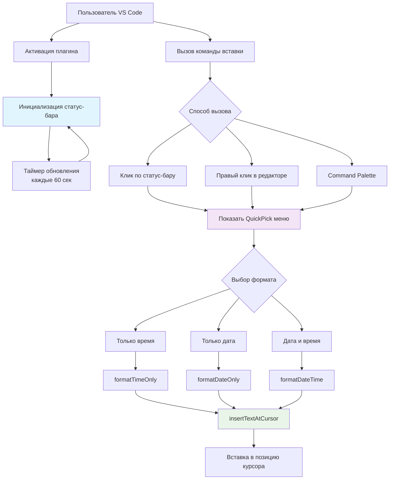

## **Technical Documentation**

### **1. Техническое задание **

**Плагин:** Timestamp Inserter для VS Code  
**Цель:** Создание расширения для быстрой вставки текущей даты и времени в редактор кода  
**Среда разработки:** Visual Studio Code  
**Язык реализации:** JavaScript с использованием VS Code API  

**Работа плагина:**
1. Отображение текущего времени в статус-баре VS Code
2. Автоматическое обновление времени каждые 60 секунд
3. 3 формата вставки:
   - Только время (HH:MM)
   - Только дата (YYYY-MM-DD)
   - Полная дата и время (DD.MM.YYYY HH:MM:SS)
4. Несколько способов вызова:
   - Клик по времени в статус-баре
   - Правый клик в редакторе → "Insert Timestamp"
   - Command Palette (Ctrl+Shift+P)

---

### **2. Архитектура плагина**

**Архитектуры:**
1. **Инициализация** - при запуске создается статус-бар с таймером обновления
2. **Интерфейс вызова** - 3 способа активации команды вставки
3. **Выбор формата** - пользователь выбирает нужный формат через QuickPick
4. **Форматирование** - специализированные функции обработки даты/времени
5. **Вставка** - итоговый текст добавляется в позицию курсора

**Описание функций:**
## **3. Документация функций**

### `formatTimeOnly(date)`
**Вход:** `Date`  
**Выход:** `string` (формат "ЧЧ:ММ")  
**Пример:** `"14:30"`

### `formatDateOnly(date)`
**Вход:** `Date`  
**Выход:** `string` (формат "ГГГГ-ММ-ДД")  
**Пример:** `"2024-11-21"`

### `formatDateTime(date)`
**Вход:** `Date`  
**Выход:** `string` (формат "ДД.ММ.ГГГГ ЧЧ:ММ:СС")  
**Пример:** `"21.11.2024 14:30:45"`

### `insertTextAtCursor(editor, text)`
**Вход:** 
- `editor: vscode.TextEditor` 
- `text: string`  
**Выход:** `void`  
**Действие:** Вставляет текст в позицию курсора

### `activate(context)`
**Вход:** `context: vscode.ExtensionContext`  
**Выход:** `void`  
**Действие:** Точка входа плагина, создаёт статус-бар и регистрирует команды

---